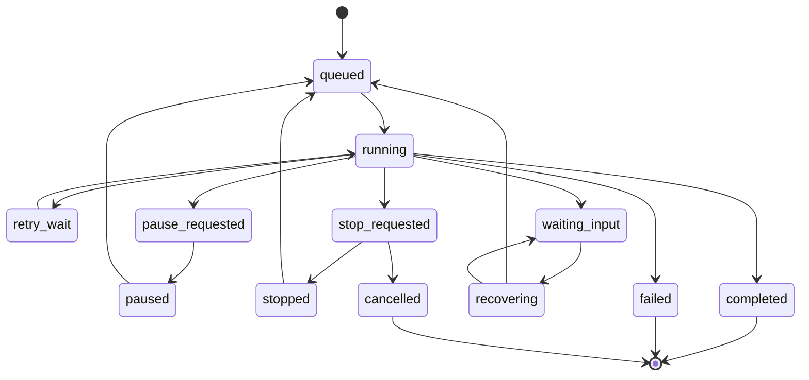

# Состояния и команды управления

Статус: контракт для реализации v1; полная проверка движком ещё не выполнена. Связанные документы: [описание](../PROJECT_DESCRIPTION.md), [runtime](RUNTIME_CONTRACTS.md), [исполнение](EXECUTION_CONTRACTS.md).

После ревью этапов 4–5 проверены simulated-посещения/попытки, управление, resume/reconciliation, бюджет и Windows ProcessSupervisor. [Границы реализации и CLI](CONTROL_AND_RECOVERY.md): native permission/interrupt и внешний статус конкретных harness подключаются в этапах 6–7. Таблица ниже задаёт полный контракт v1.

Группы моделей (§7.5 описания проекта) сохраняют приоритетный список кандидатов в snapshot Run. Новый StepExecution, включая repair, начинает с первого приоритета. Resume прерванного посещения сохраняет выбранного кандидата, пока он доступен; при подтверждённой недоступности поиск продолжается ниже его позиции. Прямой выбор модели остаётся за пределами группы и не получает автоматической замены.

## 1. Инварианты

Состояние — сохранённая в БД проекция журнала событий. У Run есть `state_version`, `resume_target`, `waiting_reason`, `stop_goal` и текущая попытка. Завершение шага, выбор следующего узла, обновление версии и событие фиксируются в одной короткой транзакции.

- В Run одновременно не более одной незавершённой внешней попытки; запрос разрешения harness также считается незавершённой попыткой. Каждая фактическая попытка кандидата из группы получает собственную StepAttempt в рамках того же StepExecution.
- Новый внешний вызов запрещён при неподтверждённом завершении старого вызова, при потере lease или конфликте резервации.
- Терминальные состояния Run: completed, failed, cancelled. Из них продолжение не разрешено; повтор задачи создаёт новый Run.
- Прерывание не откатывает файлы. Решение модели и факт завершения процесса хранятся раздельно.
- Для paused/stopped/waiting_input сохраняется точка продолжения. В waiting_input также сохраняются код причины, доказательства её устранения и допустимые действия.
- Все неуказанные переходы запрещены. HTTP 409 возвращает актуальное состояние и допустимые команды, не изменяя Run.

## 2. Переходы Run

| Из | Событие / условие | В |
| --- | --- | --- |
| queued | Worker получил lease, резервацию и успешно повторил изменяемые проверки preflight | running |
| queued | Проблема доступа, настроек или доверия после постановки в очередь | waiting_input |
| queued | pause / stop / cancel до внешнего вызова | paused / stopped / cancelled |
| running | Рабочий шаг завершён, есть следующий узел | running с новым cursor |
| running | Достигнут End и выполнены условия завершения | completed |
| running | Подтверждённая безопасно повторяемая ошибка | retry_wait |
| running | Нет автоматического решения: данные, разрешение, лимит, неизвестный исход | waiting_input |
| running | Невосстановимая техническая ошибка, живых операций не осталось | failed |
| running | pause | pause_requested |
| running / pause_requested | stop либо cancel | stop_requested, `stop_goal=stopped` либо `cancelled` |
| pause_requested | Текущий шаг успешно завершён, ещё есть работа | paused; следующий cursor уже сохранён |
| pause_requested | Текущий шаг завершает весь Run | completed |
| pause_requested | Шаг требует retry или ввода | paused с сохранённым retry_target либо waiting_input с сохранённым намерением паузы |
| retry_wait | Наступил retry_at, бюджет и владение действительны | running с новой попыткой |
| retry_wait | pause / stop / cancel, живой операции нет | paused / stopped / cancelled |
| stop_requested | Остановка локальных исполнителей подтверждена | stopped либо cancelled по stop_goal |
| stop_requested | Остановка не подтверждена в срок | waiting_input(process_not_responding), stop_goal сохраняется |
| paused / stopped | resume; причины устранены, старая операция завершена | queued либо retry_wait согласно resume_target |
| waiting_input | resolve и resume; проблема подтверждённо устранена | recovering, queued, retry_wait или продолжение ожидающего permission-запроса в running |
| waiting_input | pause / stop / cancel | Если есть живой вызов: pause_requested / stop_requested / stop_requested; иначе paused / stopped / cancelled |
| paused / stopped | cancel | cancelled, если нет неопределённой операции с доступом к каталогу |
| любое нетерминальное с потерянным владельцем | Новый worker начал сверку | recovering |
| recovering | Итог внешней операции подтверждён | Зафиксировать его и продолжить по журналу: queued, retry_wait, paused, stopped, completed, failed или cancelled |
| recovering | Нет достаточных доказательств / доступна только ручная сверка | waiting_input(unknown_external_result) |
| recovering | stop / cancel | stop_requested; сначала остановка/сверка, затем целевое состояние |

`workspace_conflict` в обычной очереди — причина ожидания queued, не ошибка, требующая вмешательства. waiting_input с этим кодом нужен при повреждённой или неразрешимой резервации.

`resume_target` содержит node/execution ID, сохранённый retry_at, действие `dispatch_next`, `retry_attempt`, `reconcile` или `answer_permission`, а также неустранённые blockers. Pause/stop не удаляют blockers; resume не обходит их. Принятое ожидание повтора сохраняет время, поэтому пауза не позволяет обойти backoff.

Диаграмма показывает основные пути; полная таблица выше определяет разрешённые переходы, включая гонки и ожидание разрешений.

## 3. Посещения и попытки

StepExecution — посещение узла, StepAttempt — конкретный внешний вызов. Возврат по связи создаёт новое посещение. Технический повтор или продолжение остановленного шага создают новую попытку существующего посещения.

| Объект | Переходы |
| --- | --- |
| StepExecution | pending → running либо skipped |
| StepExecution | running → succeeded, failed, retry_wait, waiting_input, interrupted |
| StepExecution | retry_wait → running, waiting_input или interrupted |
| StepExecution | waiting_input → running, interrupted, failed; → succeeded только при подтверждении ранее неизвестного результата |
| StepExecution | interrupted → running при новой попытке либо → succeeded после доказанной сверки прежнего результата |
| StepExecution | succeeded/failed/skipped — терминальные, не переоткрываются |
| StepAttempt | prepared → running; prepared → interrupted, если вызов ещё не начался |
| StepAttempt | running → waiting_input при живом permission-запросе |
| StepAttempt | waiting_input → running после ответа либо → interrupted/unknown после остановки |
| StepAttempt | running → succeeded, failed, interrupted, unknown |
| StepAttempt | succeeded/failed/interrupted/unknown — терминальные, не переписываются |

`unknown` означает, что нельзя доказать исход запроса, а не отсутствие эффекта. Последующая сверка создаёт отдельную запись ReconciliationResult с evidence, поколением worker и решением. Она может завершить посещение, не изменяя исходный итог попытки. Поздний пакет относится к старой попытке, сохраняется с `late=true` и сам по себе не завершает новую.

Для Start/Condition/End и других чисто серверных действий результат можно записать без внешнего StepAttempt, сохраняя StepExecution и события. Не создаются фиктивные session IDs.

## 4. Команды и их приоритет

API: `POST /runs/{id}/commands`. Тело содержит `command_id`, `type`, `expected_state_version` и допустимый для команды payload. Start использует отдельный `idempotency_key`. Журнал хранит hash запроса, sequence команды, инициатора, время, статусы accepted/applied/rejected/superseded и ответ.

Сначала проверяется дубликат command_id: одинаковый payload возвращает прежний ответ даже при изменившейся версии Run, другой payload даёт 409. Затем проверяются версия и допустимость команды. Принятие новой команды атомарно добавляет запись журнала и увеличивает state_version; применение и фактический переход также версионируются. При конфликте двух вкладок отклонённая команда не применяется позже автоматически.

| Состояния | Допустимые команды |
| --- | --- |
| queued, running, retry_wait | pause, stop, cancel |
| pause_requested | pause (no-op), stop, cancel |
| paused | pause (no-op), stop → stopped, resume, cancel; resolve для сохранённого blocker |
| stop_requested | stop (no-op), cancel повышает stop_goal до cancelled |
| stopped | stop (no-op), resume, cancel; resolve для сохранённого blocker |
| waiting_input | resolve, resume при устранённых blockers, pause, stop, cancel |
| recovering | stop, cancel; resolve только для запрошенного доказательства сверки |
| completed, failed | Просмотр; команды управления отклоняются |
| cancelled | cancel (no-op); остальные команды отклоняются |

Приоритет ещё не применённых совместимых намерений: cancel > stop > pause. Resume не отменяет stop_requested и не может оживить cancelled. Приоритет не меняет уже зафиксированный результат: если транзакция End опередила cancel, Run остаётся completed, команда получает 409; если cancel зафиксирован первым, новые узлы не запускаются.

Если stop принят раньше фиксации завершения шага, подтверждённый успешный результат шага всё равно сохраняется, но следующий узел не запускается: Run становится stopped. Resume продолжает с нового cursor, не повторяя выполненное действие.

## 5. Ожидание, лимиты и неизменяемые входы

`waiting_reason = {code, details, allowed_actions, blocked_operation_id, resolution_schema}`. Resolve сохраняет решение, но само по себе не запускает работу. В paused/stopped оно также разрешено при сохранённом blocker и не меняет состояние: например, для увеличения лимита после паузы. Resume повторно проверяет конкретную причину: новый ключ доступен, evidence собрано, процесс остановлен, запрошенный лимит действительно увеличен и т. п.

Исходные input, план, direct-модель или полный список группы, промпты, граф и разрешения Run неизменяемы. Новые сообщения чата не меняют их. Недостающие данные передаются как отдельные resolution-артефакты в рамках существующих критериев и разрешённых источников. Изменение задачи, критериев, direct-модели, состава/порядка группы или разрешений требует нового Run. Переход к следующему кандидату внутри snapshot — изменение позиции исполнения, а не изменение конфигурации.

При исчерпании группы StepExecution ожидает разрешения с model_group_exhausted; Run получает waiting_input с диагностикой всех кандидатов. Retry остаётся на прежнем кандидате и создаёт отдельную StepAttempt. Восстановление worker сначала сверяет незавершённую попытку и сохранённую позицию; автоматического сброса к первому кандидату нет. Явное resume после восстановления доступа допускает новый ограниченный проход прежнего списка, сохраняя историю и бюджеты; неизвестный результат предыдущего вызова и limit_exceeded блокируют новые попытки.

Лимиты — отдельная контролируемая политика: исходные значения входят в snapshot, дальнейшее увеличение через `resolve(limit_exceeded)` создаёт RunPolicyRevision. Она содержит старое/новое значение, причину и автора; счётчики остаются прежними. Это не скрытая правка snapshot.

Pause_requested не ждёт бесконечно: на шаг продолжает действовать timeout. По его истечении supervisor выполняет stop и сохраняет причину timeout. Принудительная остановка: 10 секунд на кооперативный interrupt, затем до 5 секунд на завершение локального дерева. Если подтверждения нет — waiting_input и сохранение резервации, без повторного запуска.

Для обычного HTTP LLM прекращение ожидания не доказывает отмену обработки на стороне провайдера. Cancel может завершить локальный Run с `remote_outcome=unknown`, если удалённый вызов не имеет доступа к рабочей области; стоимость остаётся неизвестной. Resume остановленного такого шага требует разрешения неизвестного результата перед новым платным запросом.

Ручное обслуживание резервации выполняется диагностической командой с журналом. Она сначала доказывает отсутствие владельца и потомков, затем снимает резервацию. «Освободить несмотря на живой процесс» в v1 не поддерживается: подтверждение пользователем не предотвращает две записи в один каталог.

## 6. Обязательные проверки контракта

Табличные тесты всех разрешённых и запрещённых переходов; stop/completion и cancel/End в обоих порядках; cancel/retry_wait; pause→stop; resume до устранения blocker; два разных command_id с устаревшей версией из двух вкладок; повтор command_id с тем же/другим payload; потеря lease; late-событие старой попытки; неизвестный исход с последующей сверкой; долгий pause_requested; неподтверждённая остановка дерева.

## Подготовка Council (частичная реализация 9A)

PlanningJob отделён от Run: drafting → merging → needs_answers | ready_for_confirmation → confirmed. Ответы/ручная правка создают новую ревизию в needs_answers или ready_for_confirmation. Отмена из любого нетерминального состояния даёт cancelled; отсутствие кворума, лимит, отказ merger или неизвестный внешний исход — failed с причиной. Confirmed/cancelled/failed терминальны; бюджет не превращается в отмену пользователя. Cancel сверяет state_version, ответы/confirm — номер ревизии; это разные счётчики. Полный контракт и остающиеся retry/resolve/harness-сценарии: [PLANNING_COUNCIL](PLANNING_COUNCIL.md).
